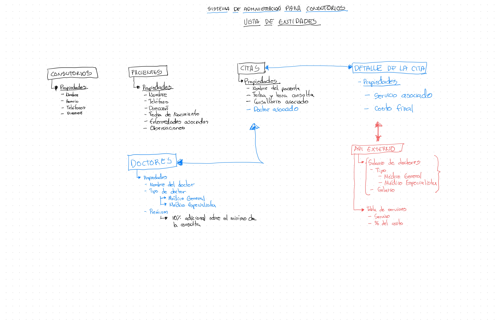
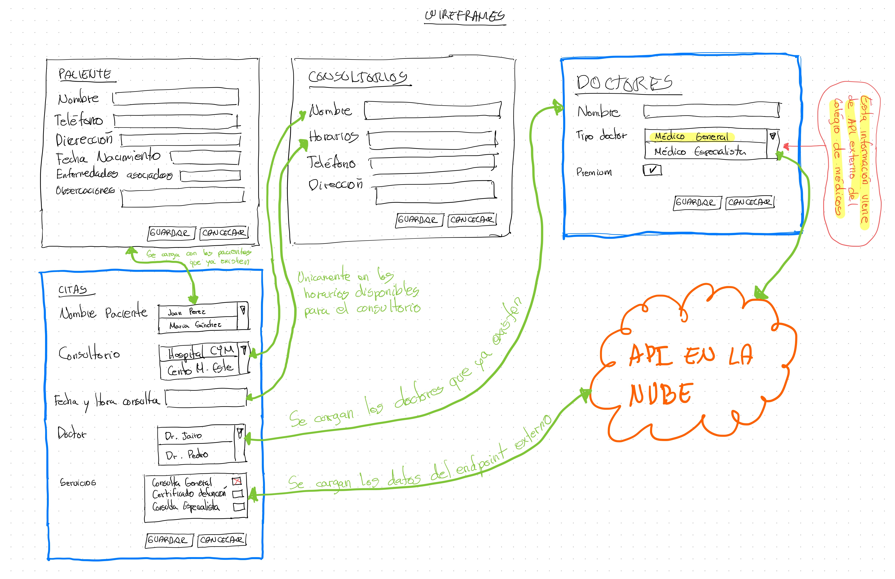
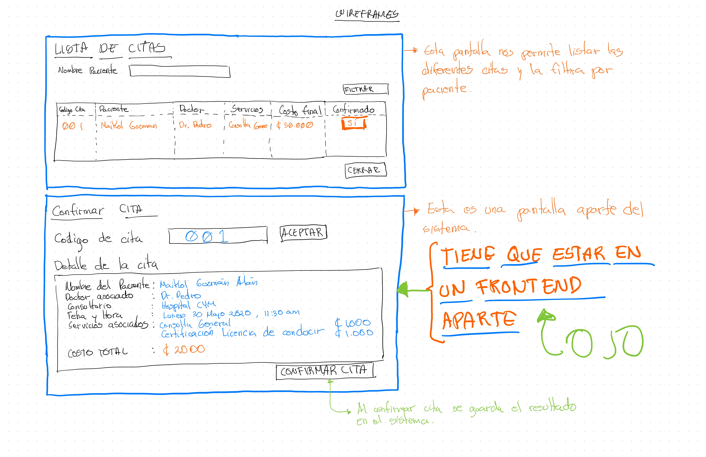

# Proyecto 2 - Sistema administrador de citas para consultorios

| CODIGO: EIF206           | ESCUELA DE INFORMÁTICA       |
| ------------------------ | ---------------------------- |
| NOMBRE: PROGRAMACIÓN III | PROFESOR: Maikol Guzmán Alán |
| VALOR: 15%               | Puntaje total: 75 puntos     |

## Técnicas

- Leer cuidadosamente el proyecto
- Seguir los estándares para presentar proyectos programados.
- Énfasis en el orden del código y la documentación del mismo

## Contenido a evaluar

- UML
  - Diagrama de clases
  - Diagrama de secuencia
  - Diseño de UI (wireframes)
- POO
- Uso correcto del Gradle y las técnicas para probar
- Patrón Model - View - Controller (MVC)
- GUI en JAVA
- Backend
  - Webservice (Servlet / Spring Boot)
  - Service
  - DAO
  - Model
  - JDBC / ORM
  - Base de Datos
- Excepciones
- Documentación (JavaDoc)

## Descripción del proyecto

### Objetivo

Desarrollar la fase completa del sistema administrador de consultorios médicos. El sistema debe de ser multi capa y multi frontend.

### Contexto

El Dr. Juan Perez, vio el potencial de los ingenieros de la Universidad Nacional de Costa Rica para desarrollar aplicaciones. El prototipo de la fase 1 fue bastante satisfactorio, por lo tanto el doctor llego a una lista de requerimientos que serán implementados en la fase II del proyecto.

#### Requerimientos técnicos

- Dos *frontend* hechos en Java (MVC)
  - Mantenimiento administrativo
  - Confirmación de citas
- Un *backend* hecho en java con un diseño multicapa
  - Webservise RESTFUL
  - Service
  - DAO
  - Base de datos MySQL
- API Externo del Colegio de Médicos de Costa Rica
  - http://www.medicos.cr/website/index.php/comunicados/21-tarifas

#### Historias de usuario ([user story](https://www.mountaingoatsoftware.com/agile/user-stories)) 

1. Como **usuario del sistema,** yo quiero una interfaz gráfica para administrar (CRUD) **pacientes** y poder tener una base de datos con la información relevante. Nombre, Teléfono, Dirección, Fecha de Nacimiento, Enfermedades Asociadas y Observaciones.
2. Como **usuario del sistema**, yo quiero una interfaz gráfica para administrar (CRUD) **consultorios** y poder tener una base de datos con la información relevante. Nombre, Horario, Teléfono y la dirección de la misma.
3. Como **usuario del sistema**, yo quiero una interfaz gráfica para administrar (CRUD) **doctores** y poder tener una base de datos con la información relevante. En esta pantalla vamos a identificar las siguientes propiedades:
   - Nombre del doctor
   - Premium, es una propiedad que si esta activada automáticamente le suma un 10% adicional sobre el mínimo de la consulta.
   - Tipo de Doctor, esta propiedad debe de cargarse directamente del API del Colegio de Médicos de Costa Rica 

**API - tipos de médicos**

```json
https://api.mlab.com/api/1/databases/colegio-medicos-cr/collections/tipomedicos?apiKey=12KfjNX97_amx0iUdS2I_eitAy3jSaOb
```

**API - resultado esperado**

```json
[
    {
        "_id": {
            "$oid": "5ec577e9e7179a6b63630180"
        },
        "tipo": "Médico General",
        "salario": "914658",
        "moneda": "crc",
        "codigo-medico": "G-1"
    },
    {
        "_id": {
            "$oid": "5ec5781ce7179a6b6363018b"
        },
        "tipo": "Médico Especialista",
        "salario": "1026213",
        "moneda": "crc",
        "codigo-medico": "G-2"
    }
]
```

4. Como **usuario del sistema**, yo quiero una interfaz gráfica para administrar (CRUD) **citas** y poder tener una base de datos con la información relevante. Las propiedades esperadas son las siguientes:
   - Campo para definir al paciente que previamente se ingresó al sistema.
   - Campo para definir el consultorio de los que previamente existen en el sistema.
   - Definición de la fecha y hora de la consulta, esta debe de verificar que sea congruente con el horario que tiene el consultorio seleccionado.
   - Campo para definir al doctor de los que previamente se ingresaron en el sistema.
   - Campo para seleccionar los servicios que el paciente va a realizar. Estos servicios deben de cargarse del API del Colegio de Médicos de Costa Rica 

**API - tipos de médicos**

```json
https://api.mlab.com/api/1/databases/colegio-medicos-cr/collections/servicios?apiKey=12KfjNX97_amx0iUdS2I_eitAy3jSaOb
```

**API - resultado esperado**

```json
[
    {
        "_id": {
            "$oid": "5ec5793fe7179a6b6363022a"
        },
        "servicio": "Consulta de Médico General en consultorio privado, por primera vez",
        "costo-porcentual": "2.5",
        "codigo-medico": "G-1"
    },
    {
        "_id": {
            "$oid": "5ec57973e7179a6b6363023d"
        },
        "servicio": "Consulta de Médico Especialista en consultorio privado, por primera vez",
        "costo-porcentual": "4",
        "codigo-medico": "G-2"
    },
    {
        "_id": {
            "$oid": "5ec579c4e7179a6b63630241"
        },
        "servicio": "Consulta de Médico General + Certificado médico en consultorio privado",
        "costo-porcentual": "3.75",
        "codigo-medico": "G-1"
    },
    {
        "_id": {
            "$oid": "5ec579eae7179a6b63630242"
        },
        "servicio": "Consulta de Médico Especialista + Certificado Médico en consultorio privado.",
        "costo-porcentual": "5.25",
        "codigo-medico": "G-2"
    },
    {
        "_id": {
            "$oid": "5ec57a0fe7179a6b63630243"
        },
        "servicio": "Visita domiciliaria para Medico General",
        "costo-porcentual": "4",
        "codigo-medico": "G-1"
    },
    {
        "_id": {
            "$oid": "5ec57a3ce7179a6b63630244"
        },
        "servicio": "Visita domiciliaria para Médico Especialista",
        "costo-porcentual": "5.5",
        "codigo-medico": "G-2"
    },
    {
        "_id": {
            "$oid": "5ec57a65e7179a6b63630245"
        },
        "servicio": "Visita domiciliaria para Medico General más certificado médico",
        "costo-porcentual": "5.25",
        "codigo-medico": "G-1"
    },
    {
        "_id": {
            "$oid": "5ec57a87e7179a6b63630298"
        },
        "servicio": "Visita domiciliaria para Médico Especialista más certificado médico",
        "costo-porcentual": "7.75",
        "codigo-medico": "G-2"
    },
    {
        "_id": {
            "$oid": "5ec57ab1e7179a6b636302a7"
        },
        "servicio": "Certificado de defunción",
        "costo-porcentual": "7",
        "codigo-medico": "G-1"
    },
    {
        "_id": {
            "$oid": "5ec57aeee7179a6b636302aa"
        },
        "servicio": "Certificado de licencia para conducir",
        "costo": "21800",
        "moneda": "crc"
    },
    {
        "_id": {
            "$oid": "5ec57b14e7179a6b636302be"
        },
        "servicio": "Certificado médico aeronáutico",
        "costo": "62000",
        "moneda": "crc"
    }
]
```

4. Como **usuario del sistema**, yo quiero una interfaz gráfica para listar las todas las **citas**. Como usuario me gustaría poder filtrar por el nombre del paciente. La lista debe de contener las siguientes columnas:

| Código Cita | Paciente           | Doctor    | Servicios                                                    | Costo Final | Confirmado |
| ----------- | ------------------ | --------- | ------------------------------------------------------------ | ----------- | ---------- |
| 001         | Maikol Guzman Alan | Dr. Pedro | Consulta de Médico General en consultorio privado, por primera vez | ¢ 22 886,5  | Sí         |

5. Como **paciente**, yo quiero una interfaz gráfica para poder confirmar y verificar información importante.
   - Nombre
   - Doctor que va a atenderme
   - Consultorio
   - La fecha y hora de la consulta
   - Servicios asociados
     - El cálculo final se debe de realizar con los datos del API del colegio de médicos y si el doctor que se seleccionó es de tipo premium el usario final va tener un incremento de 10% adicional al costo final.
   - Costo total a pagar
   - Confirmar la cita con un botón

## Entidades esperadas



## Wireframes





## Evaluación

| Detalle de evaluación                                        | Puntaje |
| ------------------------------------------------------------ | ------- |
| **[BÁSICO]** Formato del código, nombres de clases, documentación de código, nombre de paquetes, logger, excepciones. | 12      |
| **[DISEÑO]** Diagrama de secuencia                           | 2       |
| **[DOCUMENTACIÓN]** Crear el JavaDoc del Backend.            | 3       |
| **[ARQUITECTURA]** Uso correcto de los patrones de diseño    | 8       |
| **[ENTREGA SEMANA 1]** Completar las historias de usario (1 y 2) | 10      |
| **[ENTREGA SEMANA 2]** Completar las historias de usario (3 y 4) | 20      |
| **[ENTREGA SEMANA 3]** Completar las historias de usario (5 y 6) | 20      |

## Reglas

1. Trabajar en el mismo nombre de grupo, en minúscula ejemplo: (alpha, beta, charlie, echo, etc)

2. Subir al GitHub del proyecto todos los archivos necesarios para ejecutar las pruebas funcionales.

3. Si se encuentra plagio o copias entre grupos se anula la tarea de acuerdo al reglamento de la universidad.

4. El profesor únicamente revisa lo que esta en el repositório hasta la fecha de entrega. Cualquier entrega posterior a la fecha acordada se evalua de la siguiente forma.

   - **Las entregas son semanales en las clases los Lunes y Jueves por las próximas 3 semanas**

   - Si existe 1 semana de atraso, se evalua sobre 80% de la nota.
   - Si existe mas de 1 semana de atraso, se evalua sobre 70% de la nota.